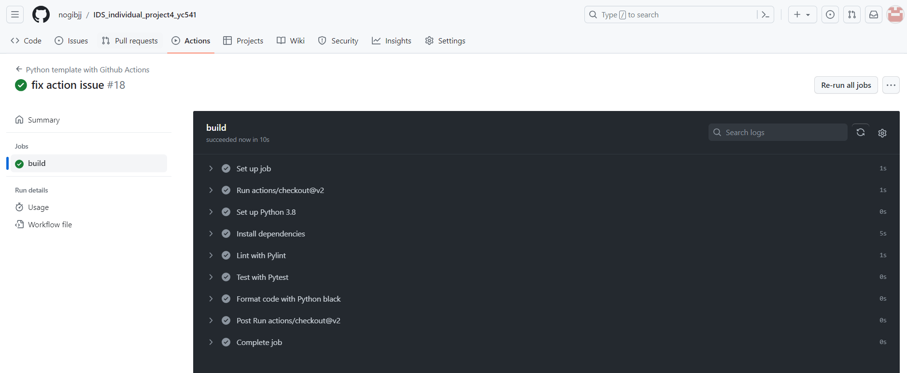

# Auto Scaling Flask App Using Azure App Services

## Table of Contents
1. [Introduction](#introduction)
2. [Requirements](#requirements)
3. [Getting Started](#getting-started)
   - [Step 1: Building the Flask Application](#step-1-building-the-flask-application)
   - [Step 2: Dockerizing the Flask App](#step-2-dockerizing-the-flask-app)
   - [Step 3: Creating a DockerHub Repository](#step-3-creating-a-dockerhub-repository)
   - [Step 4: Deploying to Azure Web App](#step-4-deploying-to-azure-web-app)
   - [Step 5: Local Testing](#step-5-local-testing)
   - [Step 6: DockerHub Integration](#step-6-dockerhub-integration)
   - [Step 7: Azure Deployment](#step-7-azure-deployment)
4. [AI-Powered Query Functionality](#ai-powered-query-functionality)
5. [CI/CD with GitHub Actions](#cicd-with-github-actions)
6. [Video Demonstration](#video-demonstration)


## Introduction

This project demonstrates how to build and deploy an auto-scaling Flask application using Azure App Services. The application is containerized using Docker and can be scaled easily to handle varying loads.

## Requirements

- Python 3.10.8
- Flask
- Docker
- Azure App Services Account
- DockerHub Account

## Getting Started

### Step 1: Building the Flask Application

The `app.py` script serves as the entry point for our Flask application. It includes routes for the home, about, use, and search pages. The search functionality integrates with the OpenAI API.

#### Project Structure:

- `app.py`: Flask application script.
- `templates/`: Folder containing HTML templates for the application (home.html, about.html, use.html, layout.html, etc.).


### Step 2: Dockerizing the Flask App

The `Dockerfile` is used to containerize the application. It includes the following key instructions:

- Base image: `python:3.10.8`
- Working directory: `/app`
- Copy application files to `/app`
- Install dependencies from `requirements.txt`
- Expose port 5000
- Run `app.py` on container launch

### Step 3: Creating a DockerHub Repository

A DockerHub account and repository are required to host the Docker container. The repository serves as a registry to store and manage our Docker images.


### Step 4: Deploying to Azure Web App

#### Azure Configuration:

- Create a web app in Azure App Services.
- Select Docker Container for deployment.
- Point to the DockerHub image.
- Configure "WEBSITES_PORT" to 5000 in Azure settings to ensure correct port mapping.

Here are some detailed steps showing in the screenshots:


Here is setting the configuration:

And the creation summary:


### Step 5: Local Testing

To test locally, execute the following Docker commands:

```bash
docker build -t app-name .
docker run -p 5000:5000 app-name
```

### Step 6: DockerHub Integration

Login to DockerHub and push the built image:

```bash
docker login --username=YOUR_USERNAME
docker build -t username/repo .
docker push username/repo
```

### Step 7: Azure Deployment

Once pushed to DockerHub, the image is ready to be deployed on Azure. Start or restart the Azure Web App and then browse the application using the public URL provided by Azure.

Here are some screenshots showing the pages of this web app:


Here is the link to my web app: https://706flask.azurewebsites.net/

## OpenAI API Integration
### AI-Powered Query Functionality

Our Flask app includes a unique feature where users can interact directly with an AI model. This is achieved through the integration of the OpenAI API, facilitated by a JavaScript function embedded within the app's webpage.

#### How It Works:

1. **User Interaction**: Users input their query into a designated text field.
2. **API Communication**: A JavaScript function `generateText` sends the user's query to the OpenAI API. 
   - **Method**: POST request to Hugging Face's GPT-2 model endpoint.
   - **Headers**: Includes content type and authorization.
   - **Body**: User's query as JSON data.
3. **Response Handling**: 
   - The AI's response is received and parsed as JSON.
   - The generated text is displayed on the webpage.
4. **Error Management**: The function is equipped to handle and report any errors during the process.

This integration showcases the application's capacity for real-time AI interactions, adding a layer of sophistication and user engagement to the Flask app.


## CI/CD with GitHub Actions

This project employs Continuous Integration and Continuous Deployment (CI/CD) using GitHub Actions. The CI/CD process is defined in a YAML file and includes the following steps:

1. **Checkout Code**: Retrieves the source code from the GitHub repository.
2. **Set up Python**: Sets up Python 3.8 environment for testing and deployment.
3. **Install Dependencies**: Installs required Python packages.
4. **Linting**: Uses Pylint to check for code quality and adherence to coding standards.
5. **Testing**: Runs tests using Pytest to ensure application reliability.
6. **Code Formatting**: Formats code using Python black for consistent code style.

These steps ensure that every push to the repository is tested for quality and functionality before deployment.
Here is a screenshot showing the passed Github Action:


## Video Demonstration

A video walkthrough is provided in the `README.md`, demonstrating the application's features and deployment steps.


